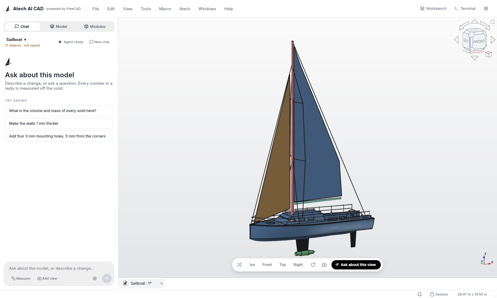
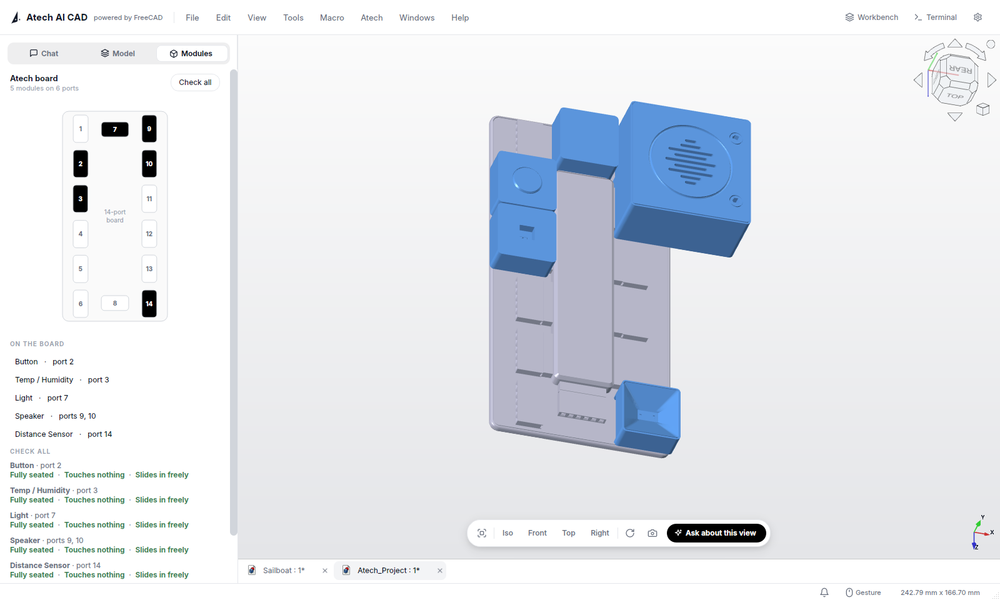
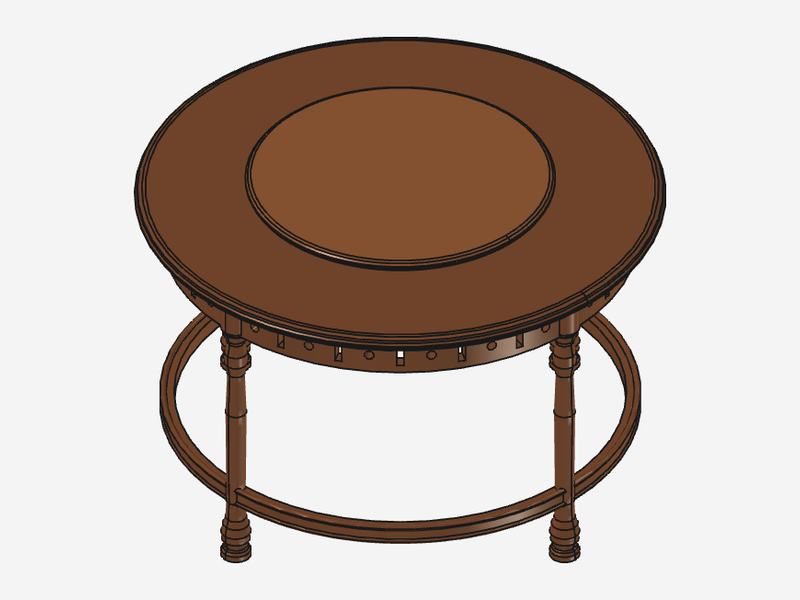
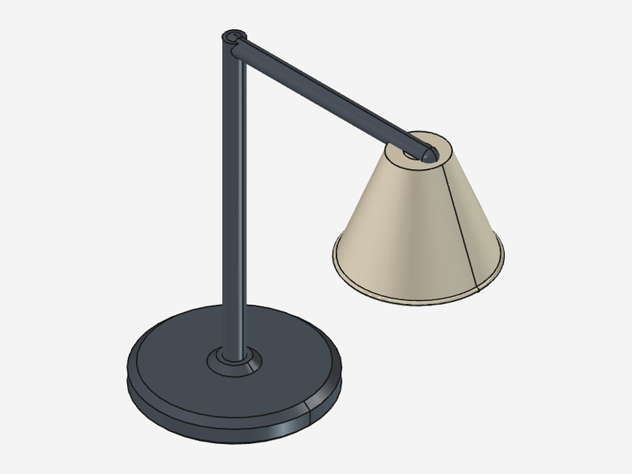
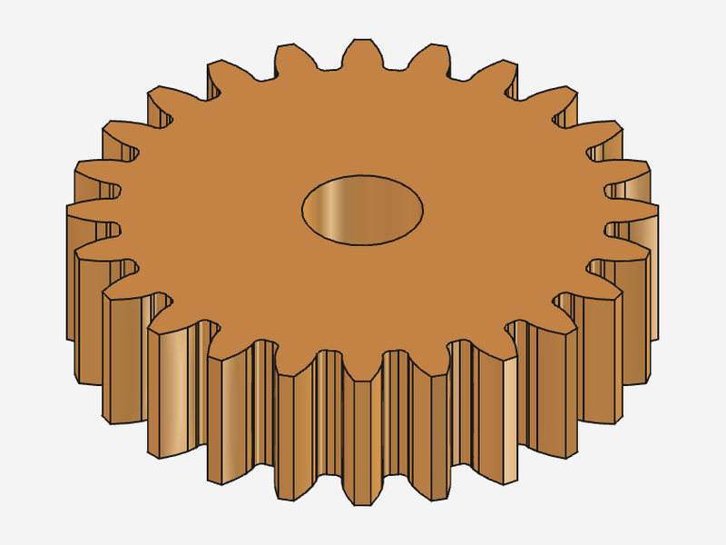
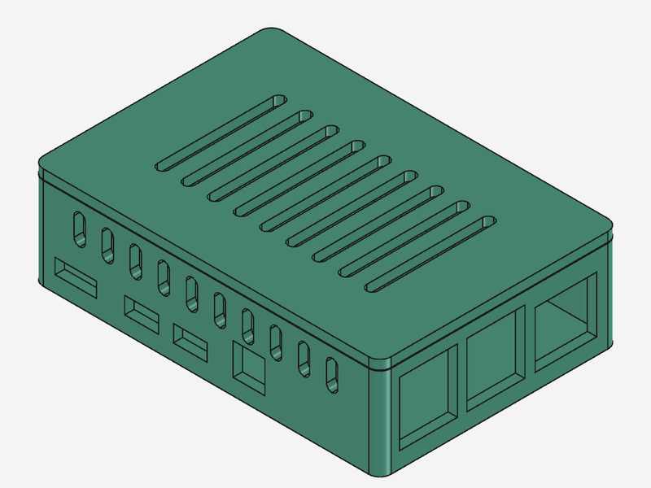
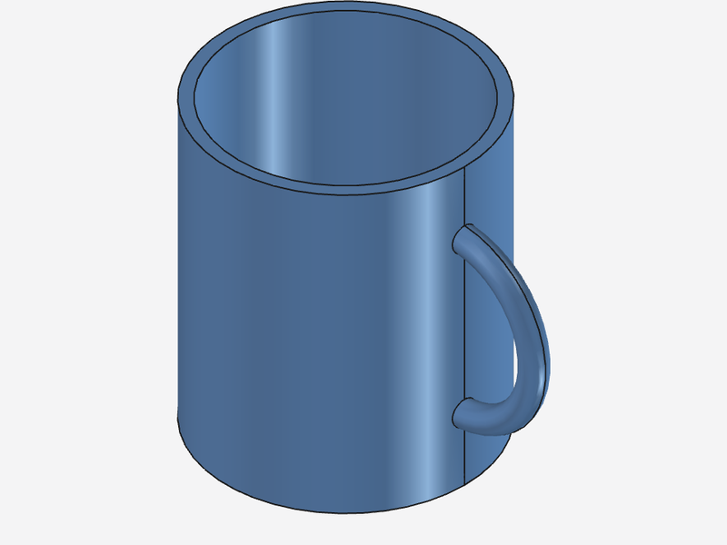
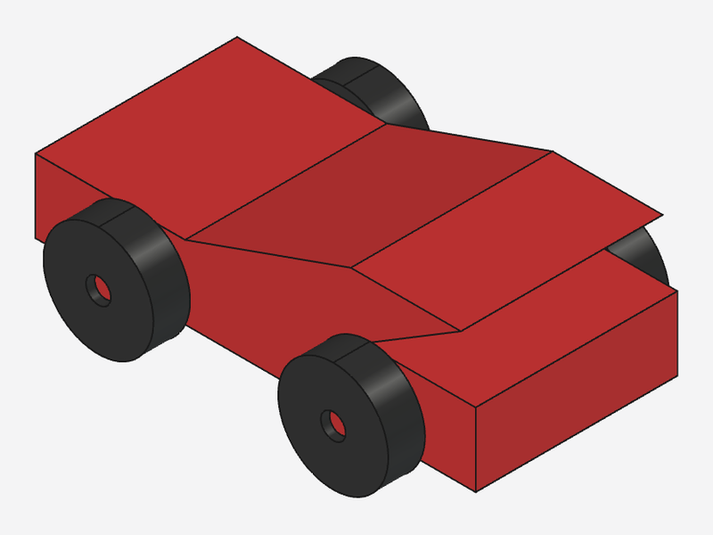
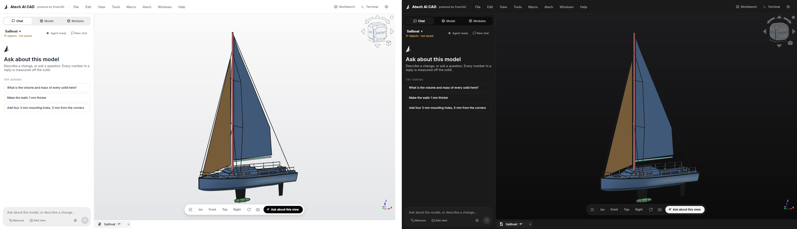

# Atech AI CAD

*Atech AI CAD, powered by FreeCAD.* (Formerly **Atech Atelier**.)

<p align="center">
  
</p>

<p align="center">
  <a href="#download-and-run">Download</a> ·
  <a href="#common-questions">Common questions</a> ·
  <a href="https://discord.gg/B6kuhUW27S">Discord</a> ·
  <a href="mailto:hello@atech.dev">hello@atech.dev</a> ·
  <a href="https://atech.dev">atech.dev</a>
</p>

Atech AI CAD is a CAD app you talk to. Describe a part in plain language,
such as *"a 40 mm cube with a 10 mm hole through the middle"*, and the agent
writes a FreeCAD script, runs it, **measures** the result and shows it in the
3D view. The volumes and sizes it reports are measured off the solid. The
result is an ordinary FreeCAD model, so you can keep editing it by hand,
save it as `.FCStd` or export it as STEP or STL for printing.

It also knows the Atech hardware: the 14-port board and its plug-in modules
ship inside the app, so you can design enclosures and parts around real
modules that sit where they really go.

Atech AI CAD is the official FreeCAD 1.1.3 release, with FreeCAD's program
files unmodified (no FreeCAD source patched or recompiled), plus the Atech
workbench, theme and module library. Atech changes only the launcher
(`AppRun`), the icon and the desktop/AppStream entries, and adds a FreeCAD
branding file; `ATECH_CHANGES.txt` lists every change. It comes as one Linux
AppImage (x86_64), and nothing is installed system-wide.

> Atech AI CAD is built on FreeCAD ((C) 2001-2026 FreeCAD contributors,
> licensed "LGPL2+": the GNU LGPL version 2 or any later version). It is not
> endorsed by, affiliated with, or a product of the FreeCAD project or the
> FreeCAD Project Association.

**Status: a preview.** The latest release is 0.1.1 (still named Atech
Atelier); 0.1.2 is the first under the new name. Expect rough edges, and
please report them.

---

## Screenshots

**Real Atech hardware inside the app.** Place modules on the 14-port board,
and each one is checked: fully seated, touching nothing, sliding in freely.



**Things people have built with it.** Each one was described in the chat, and
written, built and measured by the agent:

| | | |
|:---:|:---:|:---:|
|  |  |  |
| a dining table with a lazy Susan | a desk lamp | a spur gear |
|  |  |  |
| a Raspberry Pi 4 case | a mug | a toy car |

**Light and dark.**



---

## Requirements

- **Linux, x86_64**, with a desktop session.
- **FUSE 2** to run AppImages directly (most desktops have it). Without it,
  see [Troubleshooting](#troubleshooting).
- **Claude Code**, Anthropic's command-line agent, installed and signed in.
  The chat runs on it, and Atech AI CAD does not include it. Claude Code
  needs a Claude account that includes it; see Anthropic's setup page
  (<https://code.claude.com/docs/en/setup>) for which plans do.
- **Optional: bubblewrap** (`bwrap`). When it is installed, every design
  script runs in an isolated sandbox: read-only system, no network, no view
  of your home folder. Without it the app still works, and tells you once
  what a design script can still reach. On Debian/Ubuntu: `sudo apt install bubblewrap`.

## Download and run

Download `AtechAICAD-<version>-x86_64.AppImage` and `SHA256SUMS` from
the [Releases page](https://github.com/atechdotdev/atech-ai-cad/releases),
then, in the folder you downloaded them to (releases up to 0.1.1 are named
`AtechAtelier-<version>-x86_64.AppImage`, from before the rename):

```bash
sha256sum -c --ignore-missing SHA256SUMS
chmod +x Atech*-x86_64.AppImage
./Atech*-x86_64.AppImage
```

Atech AI CAD opens on its own workbench with the chat on the right.

## Set up Claude Code (once)

### 1. Install it

The installer recommended on Anthropic's setup page
(<https://code.claude.com/docs/en/setup>):

```bash
curl -fsSL https://claude.ai/install.sh | bash
```

It puts the `claude` command in `~/.local/bin/claude`, the first place Atech
AI CAD looks. Check that it works:

```bash
claude --version
```

### 2. Sign in

```bash
claude auth login
```

Follow the steps it shows (it opens your browser). On an older Claude Code
without `claude auth`, run `claude`, type `/login`, and `/exit` when done.
Check it with:

```bash
claude auth status
```

Atech AI CAD uses this same sign-in. It never asks for your password or an
API key.

If you skip either step, the chat tells you what is missing and shows the
same commands, as text you can copy, with a **Retry** button.

### 3. Build something

Type a request in the chat and press Enter. Before your first message is
sent, the app shows what leaves your computer (below) and asks you to
continue.

## Atech modules

The **Modules** page and the **Atech → New Project** menu place real Atech
hardware modules (the 14-port board and its plug-in modules) from the library
inside the app. Nothing extra is downloaded. If the page says *"Atech modules
are missing from this installation"*, the download is incomplete: download it
again.

## Privacy: what is sent, and what is stored

The chat runs Claude Code **on your computer**, signed in to **your own**
Claude account. Atech does not run a server, and nothing goes to Atech.

**Sent to Anthropic**, through your Claude Code account, each time you send a
chat message:

- what you type;
- a summary of the open document: its name, each solid's name, volume and
  size, the Atech board and modules on it, and what you have selected in the
  3D view;
- any picture of the 3D view you attach with **Add view** or **Ask about this
  view**;
- the files the agent reads in that chat's own folder while it works: its
  design script, the pictures it renders of its own build to check it,
  the Atech reference files copied there, and what its build check
  (`./check`) prints, measurements included. The agent is started with that
  folder as its only working folder.

Claude Code also includes what it adds to any session, such as the chat
folder's path and the name of your operating system. What Anthropic does with
all of this is set by the terms of your Claude account.

**Stored on your computer:**

| what | where |
|---|---|
| one folder per chat (design script, pictures) | `~/.local/share/Atech AI CAD/v1-1/agent/` |
| the list of agent builds you accepted, and which chat belongs to which document | `~/.local/share/Atech AI CAD/v1-1/AcadAgent/`, `.../agent/sessions.json` |
| the design script of every document the agent built into | inside that `.FCStd` file, wherever you save it |
| Agent Settings (engine, model, budget, `claude` path) | `~/.config/acadagent/settings.json` |
| app preferences (theme, layout) | `~/.config/Atech AI CAD/` and `~/.config/Atech/` |
| cache | `~/.cache/Atech AI CAD/` |
| Claude Code's own conversation history | `~/.claude/` (managed by Claude Code) |

Chat folders are kept until you delete them: **Agent Settings → Clear old chat
workspaces**. To reset Atech AI CAD completely, close it and delete the
folders above.

Your normal FreeCAD installation, its settings and its addons are not
touched: Atech AI CAD keeps its own profile.

## Common questions

**Do I need Atech hardware to use Atech AI CAD?**
No. It is a full CAD app on its own. The Atech board and modules are built in
for when you want to design around them.

**Where are WiFi and Bluetooth?**
On the board. Every Atech motherboard (the 14-port and the 10-port) carries an
**ESP32-S3**, so WiFi and Bluetooth 5.0 LE come with the board itself. No
extra radio module is needed. WiFi is 2.4 GHz only. A board talks to your
computer or phone over WiFi or USB serial, with a simple JSON protocol.

**Can I wire the modules myself, without the board?**
Yes. Every Atech port carries the same six lines: **two data lines
(DATA1, DATA2), GND, 3.3 V, 5 V and 12 V**. A module only uses the lines it
needs. You can connect one to your own ESP32 or other microcontroller with
jumper wires: ground, the supply voltage the module needs, and its data
line(s) to two GPIO pins. Before you power anything, check which pin is which
on your module. **We are still writing the public wiring guide**, so ask us
for the pinout of your module on [Discord](https://discord.gg/B6kuhUW27S) or
at [hello@atech.dev](mailto:hello@atech.dev), and we will send it.

**Does it work offline?**
The CAD side does: modelling, measuring and exporting all run on your
computer. The chat needs the internet, because Claude Code runs on
Anthropic's servers.

**Which systems does it run on?**
Linux x86_64 for now, as one AppImage. Nothing is installed system-wide.

**Is it free and open source?**
Atech's code is LGPL-2.1-or-later and FreeCAD is LGPL2+. The Atech board and
module 3D models are CC BY-NC 4.0. See [Licences](#licences). The chat needs a
Claude account that includes Claude Code.

**Is this the app that used to be called Atech Atelier?**
Yes. It was renamed Atech AI CAD in version 0.1.2. On first start, it copies
your Atech Atelier (or Atech Studio) profile, chats and settings across, and
leaves the old folders untouched.

**How do I reach the team?**
Join the [Atech Discord](https://discord.gg/B6kuhUW27S) to meet other Atech
builders, show what you made and get help. You can always mail anyone on the
team (see [atech.dev](https://atech.dev)), or write to
[hello@atech.dev](mailto:hello@atech.dev). Bugs and feature requests are also
welcome as [GitHub issues](https://github.com/atechdotdev/atech-ai-cad/issues).

## Troubleshooting

**"Permission denied" when starting.** Run `chmod +x` on the file (see
above).

**"AppImages require FUSE to run" / `libfuse.so.2` not found.** Install FUSE 2
from your distribution (Ubuntu 24.04: `sudo apt install libfuse2t64`; Ubuntu
22.04: `sudo apt install libfuse2`), or run without FUSE:

```bash
./AtechAICAD-*-x86_64.AppImage --appimage-extract-and-run
```

**The chat says Claude Code is not found.** Check `claude --version` in a
terminal. If it works there but not in the app, the app does not see the same
`PATH` (a shell function or alias does not count). Set the full path to the
program in **Agent Settings** (for the official installer:
`~/.local/bin/claude`).

**The chat says you are not signed in.** Run `claude auth login` in a terminal,
then press **Retry** in the chat.

**The 3D view is empty on first start.** Use **Atech → Open Sample Crane** to
load the bundled example.

**Anything else.** Start the app from a terminal and keep what it prints. The
Report view (*View → Panels → Report view*) also shows errors from inside the
app.

## Licences

Atech AI CAD contains parts under different licences. Each applies only to
its own files.

| what | licence | text |
|---|---|---|
| Atech's code: the Atech workbench (`addon/AcadAgent`), the branding and build scripts | **LGPL-2.1-or-later** | [`LICENSE`](LICENSE) |
| Atech board and module 3D models, and `presets.yaml` | **CC BY-NC 4.0**: share and adapt for non-commercial purposes, crediting Atech, keeping the notices, linking the licence and saying if you changed them | [`LICENSE-models.md`](LICENSE-models.md) |
| FreeCAD and the libraries it bundles | their own licences (FreeCAD: "LGPL2+", the GNU LGPL version 2 or any later version, per its `LICENSE.html`; its source files mostly carry LGPL-2.1-or-later) | FreeCAD's list: `usr/share/doc/FreeCAD/ThirdPartyLibraries.html`; every package: `packages.txt` at the image root; texts: `usr/share/doc/<package>/`, `usr/share/licenses/`, `site-packages/*.dist-info/` in the app |
| third-party components Atech added (FreeCADMCP, Lucide, Feather, the AppImage type-2 runtime and the libraries it statically links), theme files derived from FreeCAD's own, and licence texts Atech adds for bundled libraries that lacked them | their own licences | `usr/share/doc/atech-ai-cad/third_party/` in the app |

Inside the app, `usr/share/doc/atech-ai-cad/` also holds `SOURCE_OFFER.txt`
(where to get the source) and `ATECH_CHANGES.txt` (every file Atech added or
changed compared with the upstream FreeCAD image, measured file by file). To
browse them without running the app:
`./AtechAICAD-*-x86_64.AppImage --appimage-extract`, then look under
`squashfs-root/usr/share/doc/`.

Claude Code is a proprietary Anthropic product. It is **not** part of Atech
AI CAD: the app runs the copy you installed, under Anthropic's terms. Atech
AI CAD is not endorsed by or affiliated with Anthropic.

The FreeCAD logo is a registered trademark (Benelux) of the FreeCAD Project
Association AISBL (FPA), which holds the rights over commercial use of the
FreeCAD name and logo; we use the name only to say what Atech AI CAD is built
on. These licences do not grant any right to use the names "Atech" or "Atech
AI CAD" or the Atech logos except to describe where the software comes from.

## Credits

Atech AI CAD stands on FreeCAD. Thank you to the FreeCAD project and its
community for the modeller, the geometry kernel integration and the whole
application this is built on, and to the people behind Open CASCADE, Qt,
Coin3D, Python and the many other open-source projects FreeCAD brings with it.

[`CREDITS.md`](CREDITS.md) lists the main projects we build on or ship (and
every component Atech adds), with the version we ship, its licence and where
its licence text is in the app; `packages.txt` at the image root lists all 326
bundled packages. In the app: *Help → Credits & Open-Source Licences* (also in the *Atech* menu).

## Building from source

The AppImage is assembled from the official FreeCAD 1.1.3 AppImage (fetched
from FreeCAD's GitHub release and checked against a pinned sha256), the Atech
workbench and branding in this repository, and the Atech module library.
FreeCAD itself is not recompiled.

```bash
./branding/build_appimage.sh --tree-only   # build and verify the app folder
./branding/build_appimage.sh               # ...and pack it into dist/AtechAICAD-<version>-x86_64.AppImage
dist/build/squashfs-root/AppRun            # run the built folder directly
```

Packing needs `appimagetool`. The build also needs python3 with numpy, Pillow
and scipy, inkscape, curl, and the Atech module library (`--artifacts DIR`).
The build checks itself and fails loudly when anything is missing. See
[`branding/README.md`](branding/README.md) for every option and dependency.
